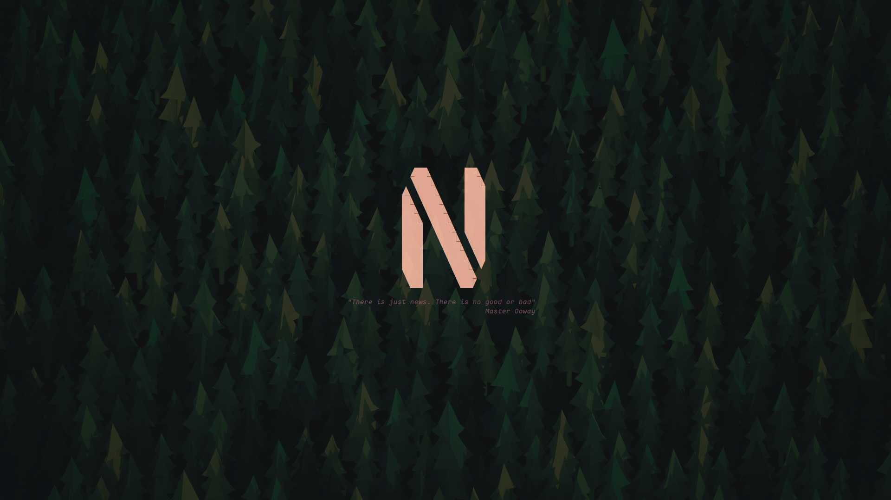

# beta.nvim

A minimal nvim greeter

Inspired by and/or based off:
- [btw.nvim](https://github.com/letieu/btw.nvim)
- [alpha-nvim](https://github.com/goolord/alpha-nvim)

## Installation
bare bones installation using `lazy.nvim`:
```lua
{
    "numen-0/beta.nvim",
    name = "beta",
    config = function()
        require("beta").setup({})
    end,
}
```

example installation:
```lua
{
    "numen-0/beta.nvim",
    name = "beta",
    config = function()
        local beta = require("beta")
        local texts = require("beta.texts")
        local logos = require("beta.logos")
        local presets = require("beta.presets")
        
        beta.setup({
            logo = require("beta.logos").neo,
            text = texts.none,
            text_list = require("beta.utils").list_topics(texts.picker, {
                "misc",
                "quotes",
                "one_piece",
                "kung_fu_panda",
            }),
            user_command = false,
        })

        -- if you want some keymaps/shorcuts you can do the next
        -- local group = vim.api.nvim_create_augroup("beta_shortcuts",
        --         { clear = true })
        --
        -- vim.api.nvim_create_autocmd("FileType", {
        --     pattern = "Beta",
        --     group = group,
        --     callback = function()
        --         local opts = {
        --             buffer  = true,
        --             noremap = true,
        --             desc    = "Beta shortcut"
        --         }
        --         local function kmap(m, lhs, rhs)
        --             vim.keymap.set(m, lhs, rhs, opts)
        --         end
        --         kmap('n', "f", require("telescope.builtin").find_files)
        --         ...
        --     end,
        -- })
    end,
}
```

## config
default config:

```lua
{
    preset = "minimal",
    gap = 0,            -- gap between logo and text
    v_aling = 0.5,      -- number @float [0.0, 1.0]; v_aling the content center
    highlight = { logo = "String", text = "Comment", }, -- default hl
    user_command = true,
    opt_local = {
        ["bufhidden"]      = "wipe",
        ["buflisted"]      = false,
        ["buftype"]        = "nofile",
        ["colorcolumn"]    = '',
        ["cursorcolumn"]   = false,
        ["cursorline"]     = false,
        ["filetype"]       = 'beta',
        ["foldcolumn"]     = '0',
        ["foldlevel"]      = 999,
        ["list"]           = false,
        ["matchpairs"]     = "",
        ["modeline"]       = false,
        -- ["modifiable"]     = false,
        ["number"]         = false,
        ["readonly"]       = false,
        ["relativenumber"] = false,
        ["signcolumn"]     = 'no',
        ["spell"]          = false,
        ["swapfile"]       = false,
        ["synmaxcol"]      = 0,
        ["undofile"]       = false,
        ["wrap"]           = false,
    },
}
```

example custom config:

```lua
{
    logo = require("beta.logos").neo,
    text = { lines = {"hello world"}, align = { style = M.Align.center, offset = 0 }},
    gap = 1,
    v_aling = 0.5,
    highlight = { logo = "String", text = "Comment", },
    user_command = true,
}
```

## Screenshots
Font: [maple](https://github.com/subframe7536/Maple-font)

Full-setup: [.dotfiles/nvim](https://github.com/numen-0/.dotfiles/tree/main/nvim)

```lua
{
    preset = require("beta.presets").minimal,
}
```


```lua
{
    preset = require("beta.presets").basic,
}
```


```lua
{
    preset = require("beta.presets").mix,
}
```


## Classes
```lua
---@enum Align
M.Align = {
    left   = "left",
    center = "center",
    right  = "right",
}

---@class Beta.Highlight
---@field logo string
---@field text string

---@class Beta.Align
---@field offset integer?
---@field style  Align

---@class Beta.Object
---@field lines     string[]
---@field hl        string?            override default hl
---@field box_lines boolean?           add spaces to make all lines same lenght
---@field align     Beta.Align?

---@alias Beta.Picker table<string, table<string, Beta.Object>>

---@class Beta.Preset
---@field logo          Beta.Object
---@field text          Beta.Object
---@field text_list     Beta.Object[]? array off text to randomly pick
---@field gap           integer

---@class Beta.Confing
---@field preset        Beta.Preset|string?
---@field logo          Beta.Object
---@field text          Beta.Object
---@field highlight     Beta.Highlight default hl
---@field text_list     Beta.Object[]? array off text to randomly pick
---@field gap           integer        gap between logo and text
---@field v_aling       number @float  [0.0, 1.0]; v_aling the content center
---@field opt_local     table<string, any>
---@field user_command  boolean?       generate user a user_cmd ":Beta"

```

## Credits
Inspired by and/or based off:
- [btw.nvim](https://github.com/letieu/btw.nvim)
- [alpha-nvim](https://github.com/goolord/alpha-nvim)

