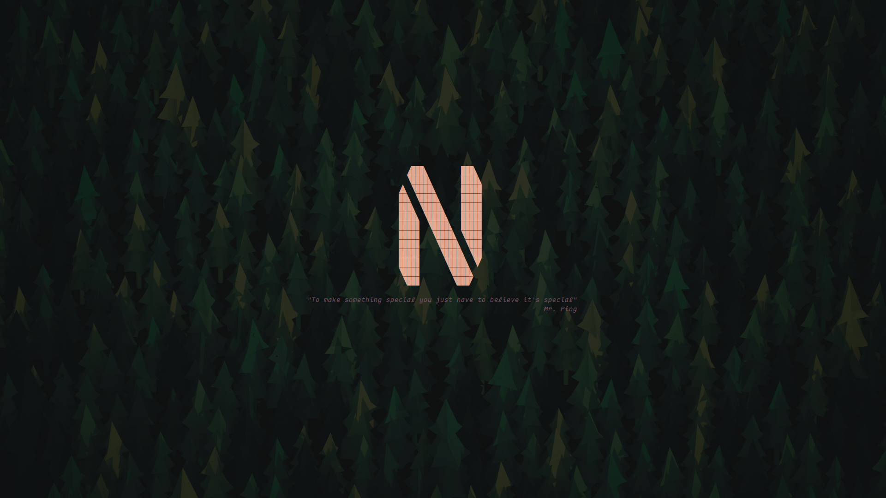

# beta.nvim

A minimal nvim greeter

Inspired by and/or based off:
- [btw.nvim](https://github.com/letieu/btw.nvim)
- [alpha-nvim](https://github.com/goolord/alpha-nvim)

## Installation
bare bones installation using `lazy.nvim`:
```lua
{
    "numen-0/beta.nvim",
    name = "beta",
    config = function()
        require("beta").setup({})
    end,
}
```

example installation:
```lua
{
    "numen-0/beta.nvim",
    name = "beta",
    config = function()
        local beta = require("beta")
        beta.setup({
            logo = {
                lines = {
                    [[┳┓    ┓┏•    ]],
                    [[┃┃┏┓┏┓┃┃┓┏┳┓ ]],
                    [[┛┗┗ ┗┛┗┛┗┛╹┗•]],
                },
                align = { offset = 0, style = "center" },
            },
            text = {
                lines = { [[btw]], },
                align = { offset = 0, style = "center" },
            },
            gap = 0,
            -- generate user a user_cmd ":Beta"
            user_command = false,
            -- WARN: this may lead to some visual bugs
            hide_cursor  = true,
            -- unload the plugin after it was used (user_command=false)
            unload_after = true,
        })

        -- if you want some keymaps/shorcuts you can do the next
        vim.api.nvim_create_autocmd("FileType", {
            pattern = "Beta",
            -- NOTE: beta will delete this autocmd if a Beta buffer can't be
            --       opened (if user_command = false)
            group = beta.group,
            callback = function()
                local opts = {
                    buffer  = true,
                    noremap = true,
                    desc    = "Beta shortcut"
                }
                local function kmap(m, lhs, rhs)
                    vim.keymap.set(m, lhs, rhs, opts)
                end
                kmap('n', "f", require("telescope.builtin").find_files)
                -- ...
            end,
            once = true, -- if you have user_command = false
        })
    end,
}
```

## config
default config:

```lua
{
    preset       = nil,
    logo         = beta.none,
    text         = beta.none,
    gap = 0,            -- gap between logo and text
    v_aling = 0.5,      -- number @float [0.0, 1.0]; v_aling the content center
    highlight = { logo = "String", text = "Comment", }, -- default hl
    user_command = false,
    hide_cursor  = false,
    unload_after = true,
}
```

example custom config:

```lua
{
    logo = require("beta.logos").neo,
    text = {
        lines = { "hello world" },
        align = {
            style = require("beta").Align.center,
            offset = 0
        }
    },
    gap = 1,
    v_aling = 0.5,
    highlight = { logo = "String", text = "Comment", },
    user_command = true,
}
```

## Screenshots
Font: [maple](https://github.com/subframe7536/Maple-font)

Full-setup: [.dotfiles/nvim](https://github.com/numen-0/.dotfiles/tree/main/nvim)

```lua
{
    logo = {
    -- http://www.patorjk.com/software/taag/#p=testall&f=Graffiti&t=NeoVim.
    -- Font Name: tmplr
    -- *modified*
        lines = {
            [[┳┓    ┓┏•    ]],
            [[┃┃┏┓┏┓┃┃┓┏┳┓ ]],
            [[┛┗┗ ┗┛┗┛┗┛╹┗•]],
        },
        align = { offset = 0, style = "center" },
    },
    text = {
        lines = { [[btw]], },
        align = { offset = 0, style = "center" },
    },
    gap = 0,
}
```


```lua
{
    -- src: https://github.com/goolord/alpha-nvim/discussions/16?sort=top#discussioncomment-3064967
    logo = {
        lines = {
    [[                                                                     ]],
    [[      ████ ██████           █████      ██                      ]],
    [[     ███████████             █████                              ]],
    [[     █████████ ███████████████████ ███   ███████████    ]],
    [[    █████████  ███    █████████████ █████ ██████████████    ]],
    [[   █████████ ██████████ █████████ █████ █████ ████ █████    ]],
    [[ ███████████ ███    ███ █████████ █████ █████ ████ █████   ]],
    [[██████  █████████████████████ ████ █████ █████ ████ ██████]],
        },
        align = { offset = 0, style = "center" },
    },
    text = {
        lines = {
            [["An idiot admires complexity, a genius admires simplicity"]],
            [[                                            Terry A. Davis]],
        },
        align = { offset = 0, style = "center" },
    },
    gap = 1,
}
```


```lua
{
    -- src: https://github.com/goolord/alpha-nvim/discussions/16?sort=new#discussioncomment-10062303
    -- *modified*
    logo = {
        lines = {
            [[   ███        ███  ]],
            [[   ████       ████ ]],
            [[  ████      █████ ]],
            [[ ██ ████     █████ ]],
            [[ ███ ████    █████ ]],
            [[ ████ ████   █████ ]],
            [[ █████  ████  █████ ]],
            [[ █████   ████ ████ ]],
            [[ █████    ████ ███ ]],
            [[ █████     ████ ██ ]],
            [[ █████      ████  ]],
            [[ ████       ████   ]],
            [[  ███        ███   ]],
        },
        align = { offset = 0, style = "center" },
    },
    text = {
        lines = {
            [["To make something special you just have to believe it's special"]],
            [[                                                         Mr. Ping]],
        },
        align = { offset = 0, style = "center" },
    },
    gap = 1,
}
```


## Classes
```lua
---@enum Align
M.Align = {
    left   = "left",
    center = "center",
    right  = "right",
}

---@class Beta.Highlight
---@field logo string
---@field text string

---@class Beta.Align
---@field offset integer?
---@field style  Align                 left|center|right

---@class Beta.Object
---@field lines     string[]
---@field hl        string?            override default hl
---@field box_lines boolean?           add spaces to make all lines same lenght
---@field align     Beta.Align?

---@alias Beta.Picker table<string, table<string, Beta.Object>>

---@class Beta.Preset
---@field logo          Beta.Object
---@field text          Beta.Object
---@field text_list     Beta.Object[]? array off text to randomly pick
---@field gap           integer

---@class Beta.Confing
---@field preset        Beta.Preset?   priority: def_conf << preset << opts
---@field logo          Beta.Object
---@field text          Beta.Object
---@field highlight     Beta.Highlight default hl
---@field text_list     Beta.Object[]? array off text to randomly pick
---@field gap           integer        gap between logo and text
---@field v_aling       number @float  [0.0, 1.0]; v_aling the content center
---@field user_command  boolean?       generate user a user_cmd ":Beta"
---@field hide_cursor   boolean?       WARN: this may lead to some visual bugs
---@field unload_after  boolean?       unload the plugin after it was used (user_command=false)
```

## Credits
Inspired by and/or based off:
- [btw.nvim](https://github.com/letieu/btw.nvim)
- [alpha-nvim](https://github.com/goolord/alpha-nvim)

